# CI/CD Pipeline Documentation

## Overview

This project uses GitHub Actions for continuous integration (CI) that automatically tests and builds the PetCarePlus application, pushing container images to GitHub Container Registry (GHCR) for manual deployment.

## Branching Strategy

```
main/prod ← (Production-ready code)
    ↑
   dev ← (Integration branch) 
    ↑
  feat/* ← (Feature branches)
  fix/*  ← (Bug fix branches)
  hotfix/* ← (Hot fix branches)
```

## Workflows

### 1. Feature Branch Validation (`feature-validation.yml`)

**Triggers:** 
- Push to `feat/*`, `fix/*`, `hotfix/*` branches
- Any file changes in the project

**Actions:**
- ✅ **Backend Tests**: Restore, build, unit tests, integration tests
- ✅ **Frontend Tests**: Install deps, build, lint
- ✅ **Summary Report**: Combined validation status
- ✅ Uses `ASPNETCORE_ENVIRONMENT: Testing`

### 2. PR to Production Validation (`pr-validation.yml`)

**Triggers:**
- Pull requests to `dev`, `main`, `prod` branches

**Actions:**
- ✅ Backend comprehensive testing
- ✅ Frontend build and linting  
- ✅ Docker build test
- ✅ Automated PR comments with results

### 3. Build and Push Container (`build-and-push.yml`)

**Triggers:**
- Push to `dev`, `main`, `prod` branches
- When backend/frontend/Docker files change

**Actions:**
- 🐳 Build Docker image using multi-stage Dockerfile
- 📦 Push to GitHub Container Registry (GHCR)
- 🏷️ Simple tags: `latest` and `{commit-sha}`

## Container Image Details

- **Registry**: `ghcr.io/naveeth235/petcareplus`
- **Tags**: 
  - `latest` (always latest from main/dev/prod)
  - `{commit-sha}` (specific commit reference)
- **Image URL**: `ghcr.io/naveeth235/petcareplus:latest`

## Azure App Service Setup

Use this container image URL in your Azure App Service for Containers:

```
ghcr.io/naveeth235/petcareplus:latest
```

### Required Azure App Service Environment Variables:
```
ASPNETCORE_ENVIRONMENT=Production
ASPNETCORE_URLS=http://+:80
MySql={Your Azure MySQL Connection String}
JWT_ISSUER={Your JWT Issuer}
JWT_AUDIENCE={Your JWT Audience}
JWT_SECRET={Your JWT Secret - 32+ characters}
```

## Environment Variables by Environment

| Environment | Database | JWT Config | CORS | Migrations |
|-------------|----------|------------|------|------------|
| **Development** | Local MySQL | appsettings.Development.json | localhost:5173 | ✅ Auto |
| **Testing** | In-memory | appsettings.Testing.json | Any | ❌ None |
| **Production** | Azure MySQL | Environment Variables | Any origin | ✅ Auto |

## CI Flow

```mermaid
graph LR
    A[feat/* branch] --> B[Feature Validation]
    B --> C{Tests Pass?}
    C -->|✅| D[Create PR to dev]
    C -->|❌| E[Fix Issues]
    D --> F[PR Validation]
    F --> G{All Tests Pass?}
    G -->|✅| H[Merge to dev]
    G -->|❌| I[Fix Issues]
    H --> J[Build & Push Container]
    J --> K[Manual Deploy to Azure]
```



## Manual Deployment Process

1. **Automatic**: Container is built and pushed to GHCR on merge to dev/main/prod
2. **Manual**: Deploy from Azure portal using the container image URL
3. **Configuration**: Set environment variables in Azure App Service
4. **Health Check**: Visit `{your-app-url}/health` to verify deployment

## Local Development vs CI

### Feature Branch Testing:
- **Backend**: Unit tests + Integration tests  
- **Frontend**: Build + Lint
- **Trigger**: Any changes to any files

### PR Validation:
- **Backend**: Comprehensive testing
- **Frontend**: Build + Lint
- **Docker**: Build test only (no push)

### Container Build:
- **Trigger**: Push to dev/main/prod only
- **Output**: Ready-to-deploy container image

## Monitoring and Troubleshooting

### Health Check Endpoint
- **URL**: `{your-app-url}/health`
- **Expected Response**: `{"status":"ok"}`

### Common Issues
1. **Build Failures**: Check .NET version compatibility
2. **Test Failures**: Verify appsettings.Testing.json configuration  
3. **Container Issues**: Check Dockerfile paths and multi-stage build
4. **GHCR Access**: Ensure GitHub token has package write permissions

## Security Considerations

- ✅ GitHub token used for GHCR authentication
- ✅ Minimal permissions for workflows
- ✅ Environment-specific configurations
- ✅ In-memory databases for testing
- ✅ Production secrets managed in Azure